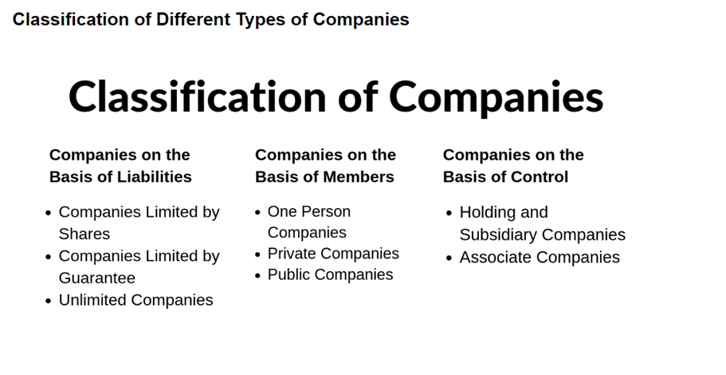

# Kinds of Companies

 

## 1. Chartered Companies
- Originally used to incorporate learned societies and professional bodies.
- Formed by the Royal Charter or special order granted by the King or Queen.
- Enjoy exclusive powers and privileges, usually established in countries with a system of kingship.
- Examples: The Bank of England, The East India Company.

## 2. Statutory Companies
- Formed by private/special Act of Parliament or by the State legislature.
- Historically used for public utilities such as gas, electricity, and railways.
- Examples: The Reserve Bank of India, The Life Insurance Corporation of India.

## 3. Unregistered Companies
- Not covered or registered under the provisions of the Companies Act.
- Cannot be wound up voluntarily and is subject to the supervision of the court.

## 4. Registered Companies
- Formed by registering under the Companies Act.
- Regulated by the provisions of the Companies Act, Memorandum of Association (MoA), and Articles of Association (AoA).
- Can be limited by shares, limited by guarantee, or unlimited.

### Classification of Registered Companies
- **Unlimited Companies:**
  - Members have unlimited liability.
  - Can be set up with or without a share capital.
  - No need to file annual accounts.
  
- **Companies Limited by Guarantee:**
  - Guarantee fund – wound up.
  - No contributed capital, not formed for business ventures.
  - Prior to 1980, could have share capital (hybrid companies).

- **Companies Limited by Shares:**
  - Most common type with contributed capital.
  - Shares have a nominal value.
  - Memorandum specifies the total nominal value of all shares.

## Private Companies
- Limits the number of members to 200.
- Restricts the right of share transfer.
- Prohibits public invitations to subscribe.
- Examples: Flipkart Internet Private Limited, Ola Electric Mobility Private Limited.

## Public Companies
- No restrictions on share transfer.
- No restrictions on the maximum number of members.
- Invites the general public to subscribe to its securities.
- Examples: SBI General Insurance Company Limited, Infosys Limited.

## Government Companies
- Not less than 51% of the paid-up capital is owned by the Central or State Government.
- May have share capital owned by the government but is not the agent of the government.
  
## Non-Government Companies
- All other companies, excluding government companies.

## Indian Companies
- Registered in India under the Companies Act.
- Registered office located in India.
- Nationality of members is immaterial.

## Foreign Companies
- Incorporated outside India but has a place of business in India.

## Holding Company
- Exercises control over another company.
- Can acquire control through equity interests, voting rights, or the right to appoint the majority of directors.
  
## Subsidiary Company
- Controlled by another company (holding company).
- Control is exercised through equity interests, voting rights, or the right to appoint the majority of directors.

## One Person Company (OPC)
- Only one person as a member.
- Cash flow statement not required.
- Nominee clause in MOA for perpetual succession.
- Annual returns signed by CS or a director.

## Small Companies
- Paid-up capital of INR 2 crore or less, and turnover of INR 20 crore or less.
- Enjoy advantages in compliance requirements, requiring only two board meetings in a fiscal year.

## Associate Company
- Owned in part by a parent company.
- Parent owns a minority or non-controlling stake in the associate company.
  
## Dormant Company
- Introduced in the Companies Act, 2013.
- Inactive or inoperative company.
- A concept also present in English Law.

## Producer Company
- Defined by the Companies Act.
- Engaged in activities connected with or relatable to any primary produce.
- Body corporate for the benefit of members involved in the production, marketing, and export of primary produce.

These categories represent the diverse landscape of companies, each with its specific characteristics and legal requirements.

