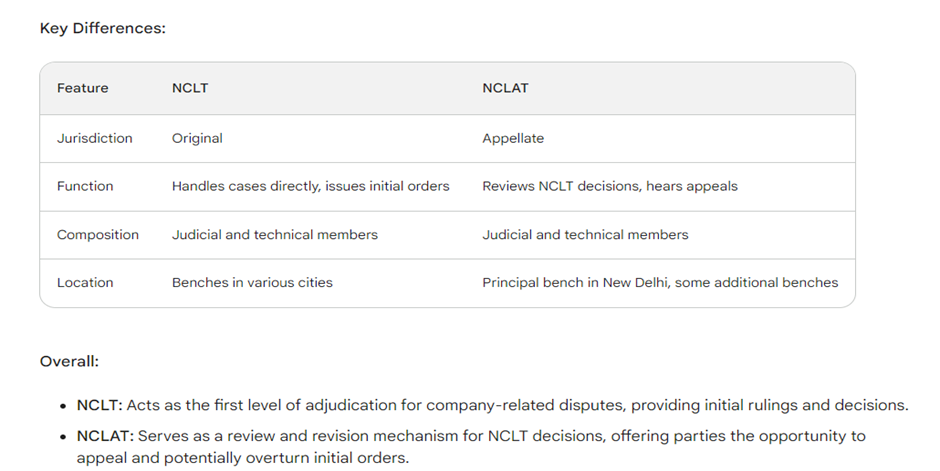

# Punishment for Improper Use of "Limited" or "Private Limited"

- Only companies that are duly incorporated with limited liability can use "Limited" or "Private Limited" in their names.
- These terms are not interchangeable.
- "Private Limited" is used for companies with restricted ownership, while "Limited" can be used by any company with limited liability.
- Misuse of these terms can have serious consequences:
  - Legal action: The company can be fined, sued, or dissolved.
  - Financial losses: Damages may be required to compensate those misled by the improper use.
  - Damage to reputation: The company may be seen as untrustworthy or fraudulent.

Under Section 453 of the Companies Act, 2013:

- Any person or entity using "Limited" or "Private Limited" without being duly incorporated with limited liability can be fined.
- The fine ranges from ₹500 to ₹2,000 per day for the period during which the name was used.
- Additionally, the Registrar of Companies can issue a stop order prohibiting the use of the name.

## Corporate Veil

- A company is regarded as a distinct legal entity, casting a veil between the company and its human constituents, known as 'the corporate veil.'
- Fundamental principle: Separate legal entity.
- Laid down in Saloman vs. Saloman & Co. (House of Lords, 1897).
- Corporate entity encourages and promotes trade and commerce.
- Corporate veil can be lifted in cases of fraud or improper conduct.

## Lifting of Corporate Veil

- The separate personality of a company is a statutory privilege for legitimate business purposes.
- "Lifting of the corporate veil" occurs when the Court breaks through the corporate shell to make individuals or controlling persons liable for company debts.
- Sections 7(7), 251(1), and 339 of the Companies Act, 2013 lift the corporate veil in specific situations.

### Judicial Interpretation for Lifting Corporate Veil

1. **Fraud or Improper Conduct:**
   - Where the corporate veil is used for fraud or improper conduct, Courts lift the veil.

2. **Agency Instrumentality:**
   - When a corporate facade is an agency instrumentality, the veil is lifted.

3. **Conflict with Public Policy:**
   - If conduct conflicts with public policy, the court lifts the veil to protect public interests.

4. **Enemy Character:**
   - If a company's de facto control is in an enemy country, the veil can be lifted.

5. **Tax Evasion:**
   - When a company is formed solely for tax evasion, the veil is ignored.

## NCLT and NCLAT

- The National Company Law Tribunal (NCLT) and the National Company Law Appellate Tribunal (NCLAT) are quasi-judicial bodies established under the Companies Act, 2013.
- They adjudicate matters related to Indian companies, providing a specialized forum for speedy dispute resolution.

